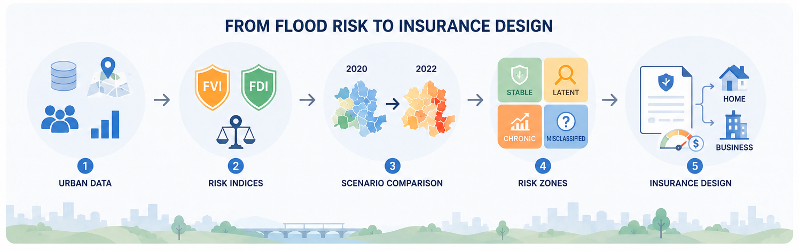

# Seoul District-Level Flood Risk Assessment and Risk-Based Insurance Model Design

<br>

🏆 **Encouragement Award, 3rd National University Student Risk Management Competition**

Hosted by Samsung Fire & Marine Insurance, POSTECH, and Seoul National University · June 2025

<br>

<br>


This project evaluates **flood vulnerability** and **disaster response capacity** across Seoul’s 25 districts and proposes a private flood insurance model that reflects regional risk levels in premiums and coverage structures.


<br>

[📊 Analysis Results](research_results.md)  
[📑 Presentation Slides](flood-risk-presentation.pdf)

<br>

---

## 💡 Project Motivation

As climate change increases the frequency of unpredictable extreme rainfall, static flood-risk assessments based only on historical damage are no longer sufficient.

This project analyzes flood damage, urban characteristics, population structure, defense infrastructure, fiscal capacity, and emergency response resources to develop a regional risk-based flood insurance framework.

<br>

<p align="center">
  
</p>

<br>

---

## 🎯 Project Objective

- Evaluate flood vulnerability and response capacity across Seoul’s 25 districts
- Identify dynamic risk changes by comparing normal conditions in 2020 with extreme rainfall in 2022
- Design a differentiated insurance model reflecting regional risk and asset characteristics

<br>

---

## 📚 Data Sources

- **Flood Damage**: Flooded households, affected population, and damage amount
- **Urban Vulnerability**: Population density, household density, and impervious surface ratio
- **Flood Defense Infrastructure**: Retention facilities, drainage pump stations, and sewer networks
- **Response Capacity**: Fiscal self-reliance and firefighting personnel
- **Weather Data**: Monsoon period and cumulative rainfall
- **Spatial Data**: District boundaries and land-use characteristics

<br>

---

## 🗂️ Analysis Procedure

The analysis reviews the limitations of existing flood-risk assessment methods and develops composite indicators that jointly capture vulnerability and response capacity.

<br>

<p align="center">
  
</p>

<br>

---

## 🔍 Methodology

### PCD Matrix

The existing PCD Matrix classifies districts by flood defense capacity and observed damage into four categories: 


🔴 **Dangerous** , 🟠 **Mess**, 🟢 **Safe**, and 🔵 **Well-Protected**

A comparison of 2020 and 2022 outcomes revealed gaps between the original classifications and actual flood damage, highlighting the need for a more comprehensive risk framework.

<br>

### FVI · FDI

Two composite indicators were developed to address the limitations of existing approaches.

- **FVI (Flood Vulnerability Index)** evaluates regional flood vulnerability using damage levels, population and household density, and impervious surface ratio.
- **FDI (Flood Defense Infrastructure Index)** measures local response capacity using defense facilities, sewer networks, fiscal self-reliance, and firefighting personnel.

Indicator weights were estimated through an expert-based **AHP** analysis.

<br>

---

## 📊 Results

By comparing risk patterns under normal conditions in 2020 and extreme rainfall in 2022, Seoul’s districts were reclassified into four risk types.

| Type | Description |
|---|---|
| **Stable** | Low risk under both normal and extreme rainfall conditions |
| **Latent-Risk** | Low risk under normal conditions but sharply higher risk during extreme rainfall |
| **Chronic-Risk** | Persistently high risk under both conditions |
| **Misclassified** | A mismatch between model-based classification and actual damage |

The results were used to estimate district-level risk coefficients and propose a differentiated premium structure that reflects regional flood exposure.

<br>

---

## 🛡️ Insurance Model Design

Residential and commercial/industrial insurance products were designed with different coverage limits, deductibles, and payout structures based on asset characteristics and regional risk types.

This framework connects flood-risk analysis directly to premium calculation and compensation design, enabling more realistic and risk-sensitive insurance products.

<br>

---


## 📁 Repository Structure

```text
flood-risk-insurance-model/
├── README.md
├── research_results.md
├── flood-risk-presentation.pdf
├── LICENSE
├── requirements.txt
│
├── assets/
│   └── images/
│       ├── flood-risk-motivation.png
│       ├── analysis-pipeline.png
│       ├── fvi-fdi-indicators.png
│       └── flood-risk-pipeline.png
│
├── scripts/
│   ├── 01_calculate_ahp_weights.py
│   ├── 02_calculate_baseline_pcd.py
│   ├── 03_calculate_fvi_fdi.py
│   ├── 04_classify_temporal_risk.py
│   ├── 05_calculate_final_risk_scores.py
│   └── run_pipeline.py
│
├── notebooks/
│   ├── 01_formula_validation.ipynb
│   └── 02_result_visualization.ipynb
│
├── data/
│   ├── raw/          (gitignored - see Data Availability)
│   ├── reference/    (gitignored)
│   └── processed/    (gitignored)
│
├── results/
│   ├── figures/      (gitignored)
│   └── tables/       (gitignored)
│
└── reports/
    ├── 01_ahp_validation_report.md
    ├── 02_baseline_pcd_validation_report.md
    ├── 03_fvi_fdi_validation_report.md
    ├── 04_risk_classification_validation_report.md
    ├── 05_final_scoring_validation_report.md
    └── artifacts/
```

<br>

---
