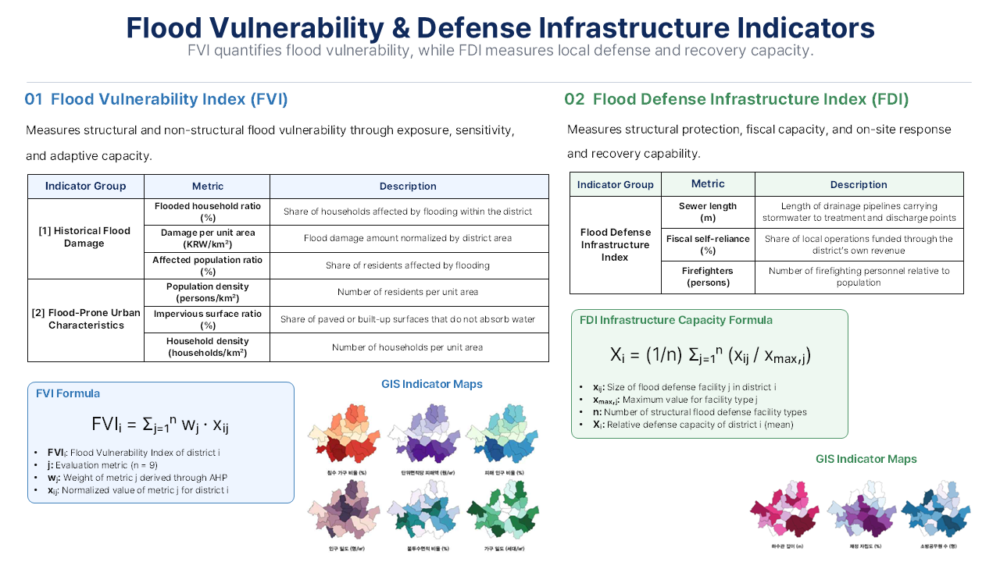
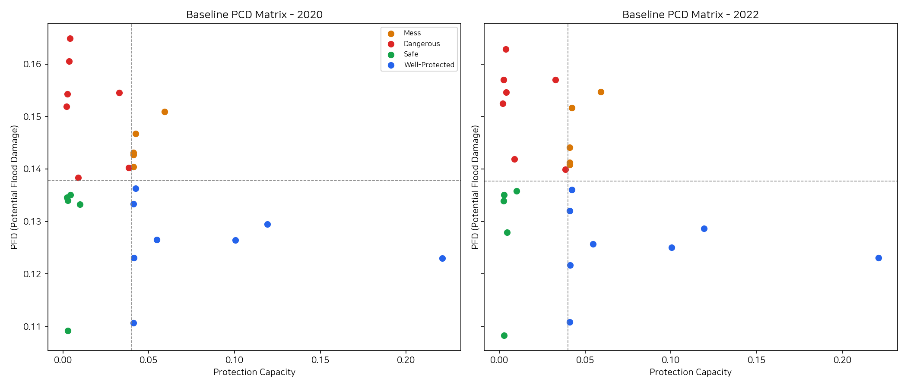

# Results

This document summarizes the main findings reported in the project paper and presentation materials.

The analysis compares flood risk across Seoul’s 25 districts using 2020 normal-weather conditions and the extreme rainfall event of 2022, then connects the results to district-level insurance pricing and coverage design.

 

---

## 1. Final District Risk Ranking

FVI and FDI were constructed as composite indicators, with weights estimated through an expert-based AHP analysis.

 

  

 

The final district score combines the two scenario-based FVI values:

`final_fvi = 0.7 × fvi_2020 + 0.3 × fvi_2022`

The district risk coefficient is then assigned by rank:

`risk_coefficient = 1.00 + 0.04 × (25 - rank)`

 

| Rank | District | FVI 2020 | FVI 2022 | Final FVI | Risk Coefficient |
|---:|:---|---:|---:|---:|---:|
| 1 | Gangdong-gu | 0.150649 | 0.028418 | 0.113980 | 1.96 |
| 2 | Yeongdeungpo-gu | 0.049914 | 0.104732 | 0.066359 | 1.92 |
| 3 | Dongjak-gu | 0.037009 | 0.111389 | 0.059323 | 1.88 |
| 4 | Seongbuk-gu | 0.069060 | 0.028030 | 0.056751 | 1.84 |
| 5 | Gwanak-gu | 0.034631 | 0.091641 | 0.051734 | 1.80 |
| 6 | Seodaemun-gu | 0.049032 | 0.049914 | 0.049131 | 1.76 |
| 7 | Guro-gu | 0.036462 | 0.062460 | 0.043348 | 1.72 |
| 8 | Songpa-gu | 0.040225 | 0.040760 | 0.040385 | 1.68 |
| 9 | Jungnang-gu | 0.043363 | 0.028958 | 0.040450 | 1.64 |
| 10 | Geumcheon-gu | 0.030772 | 0.059877 | 0.039569 | 1.60 |
| 11 | Dongdaemun-gu | 0.041043 | 0.033068 | 0.038568 | 1.56 |
| 12 | Gangnam-gu | 0.033898 | 0.044785 | 0.037164 | 1.52 |
| 13 | Yangcheon-gu | 0.039096 | 0.032126 | 0.037823 | 1.48 |
| 14 | Nowon-gu | 0.040773 | 0.024885 | 0.036672 | 1.44 |
| 15 | Mapo-gu | 0.033607 | 0.026003 | 0.031065 | 1.40 |
| 16 | Gwangjin-gu | 0.033959 | 0.028024 | 0.032230 | 1.36 |
| 17 | Seocho-gu | 0.023628 | 0.047178 | 0.030538 | 1.32 |
| 18 | Seongdong-gu | 0.031798 | 0.025995 | 0.029311 | 1.28 |
| 19 | Eunpyeong-gu | 0.029470 | 0.025402 | 0.028845 | 1.24 |
| 20 | Jung-gu | 0.028380 | 0.023394 | 0.026824 | 1.20 |
| 21 | Gangseo-gu | 0.023632 | 0.027101 | 0.024580 | 1.16 |
| 22 | Dobong-gu | 0.025379 | 0.023096 | 0.024773 | 1.12 |
| 23 | Gangbuk-gu | 0.024785 | 0.023436 | 0.024799 | 1.08 |
| 24 | Yongsan-gu | 0.022556 | 0.018929 | 0.021719 | 1.04 |
| 25 | Jongno-gu | 0.017877 | 0.014936 | 0.016717 | 1.00 |

The coefficient ranges from **1.00 to 1.96**, allowing district-level flood risk to be reflected directly in premium calculations.

 

---

## 2. Flood Risk Classification

The comparison between 2020 and 2022 showed that district risk profiles can change substantially under extreme rainfall.

Based on these changes, Seoul’s districts were reorganized into four practical insurance risk groups.

 

| Risk Type | Description | Districts |
|:---|:---|:---|
| **Stable** | Remained Safe or Well-Protected in both periods | Gangbuk-gu, Gangseo-gu, Gwangjin-gu, Geumcheon-gu, Nowon-gu, Dobong-gu, Dongdaemun-gu, Mapo-gu, Seongdong-gu, Jungnang-gu, Jongno-gu, Eunpyeong-gu, Yongsan-gu |
| **Latent-Risk** | Safe under normal conditions but shifted to Dangerous during extreme rainfall | Gwanak-gu, Guro-gu, Dongjak-gu, Seocho-gu, Jung-gu |
| **Chronic-Risk** | Remained in Mess or Dangerous conditions across both periods | Gangnam-gu, Songpa-gu, Yeongdeungpo-gu |
| **Misclassified** | Quantitative classification did not align with observed damage patterns | Gangdong-gu, Seodaemun-gu, Seongbuk-gu |

This classification shows why static flood-risk labels are insufficient: several districts that appeared safe under normal conditions became high-risk during the 2022 event.

 

  

 

---

## 3. Insurance Model Design

The final model separates insurance products into **residential** and **commercial/industrial** categories, with different coverage limits, deductibles, and target users.

 

### Residential Flood Insurance

| Type | Building Coverage | Contents Coverage | Deductible | Target |
|:---|---:|---:|---:|:---|
| Basic | KRW 200M | KRW 50M | KRW 1M | Detached and older urban housing |
| Premium | KRW 300M | KRW 100M | KRW 0.5M | High-value homes or lower-risk districts |
| Affordable | KRW 150M | KRW 30M | KRW 2M | Flood-prone areas and price-sensitive households |

 

### Commercial and Industrial Flood Insurance

| Type | Target | Building Coverage | Contents Coverage | Deductible |
|:---|:---|---:|---:|---:|
| A | Small shops and retail stores | KRW 500M | KRW 200M | KRW 1M |
| B | Manufacturing businesses | KRW 1B | KRW 500M | KRW 5M |
| C | Wholesale and logistics facilities | KRW 700M | KRW 500M | KRW 3M |
| D | Basement shops and traditional markets | KRW 500M | KRW 200M | KRW 1M |

The model expands coverage beyond buildings to household contents, machinery, inventory, and other business assets.

 

---

## 4. Risk-Based Compensation Structure

Different payout structures were proposed for each risk group to improve claim predictability and reduce over- or under-compensation.

 

| Risk Type | Compensation Structure |
|:---|:---|
| **Stable** | Linear indemnity based on actual loss |
| **Latent-Risk** | Stepwise payout using multiple rainfall triggers |
| **Chronic-Risk** | Combined stepwise and proportional-cap structure |
| **Misclassified** | Initial advance payment followed by loss-based adjustment |

For Latent-Risk districts, rainfall thresholds such as **100 mm, 150 mm, and 200 mm** were proposed as multiple payout triggers. For Misclassified districts, the model combines rapid preliminary payment with later adjustment based on verified losses.

 

---

## 5. Key Findings

- Existing flood-risk classifications did not fully explain damage during extreme rainfall.
- FVI and FDI provided a broader view of vulnerability and local response capacity.
- Temporal comparison revealed districts that shifted sharply from low to high risk.
- District-level risk coefficients enabled differentiated premium pricing.
- Asset-specific insurance design improved the realism of residential and commercial coverage.
- Risk-type-specific payout curves connected analytical results to practical insurance design.

The project demonstrates how urban flood-risk analysis can be translated into a practical insurance pricing and compensation framework.
